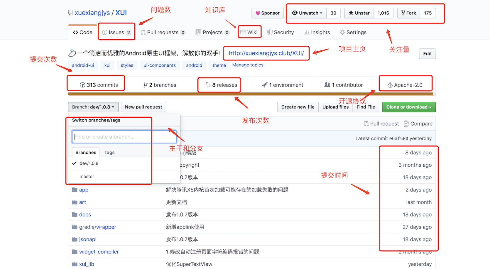

# 你真的会使用github吗？

> github作为全球最大的开源软件托管平台，自2008年上线以来，一直吸引了无数的程序开发者在上面开源分享自己的项目代码。尤其是在微软收购github之后，更是吸引了很多非程序开发者将自己的知识和经验通过平台分享出来，可以说github是一个蕴藏了无数价值和宝藏的大宝库。然而，对于这样一个极具价值的平台，你真的会使用吗？

## github的价值

github极具价值，下面我简单列举几点：

* 存放自己的项目代码和文件

* 解决实际工作中遇到的问题

* 借鉴别人的知识和经验，提升自我的能力

* 提供学习交流的场所

* 搭建自己的博客

* 提升自身行业的影响力和地位

---

## 如何使用github

> 在继续往下阅读之前，请确保你不是所谓的"伸手党"，因为以下的内容，可能对这部分的人群毫无价值，读了也是浪费时间。

### 一、如何使用github进行项目管理

1.首先，你得明确需要上传github的项目内容。这里我要特别提醒，你可别提交与公司相关的内容，你可是签过保密协议的，提交的内容要慎重，尽量避开与公司相关的内容。即使你想提交，也务必自己重写一个，当然公司核心的内容你就别提交了，重写也不行，违规的事情咱不能做。

2.在提交项目前，你得先了解`git`指令，因为在github上的所有操作都是通过`git`指令完成的，这里我有一篇[Git 常用命令](https://blog.csdn.net/xuexiangjys/article/details/79875167)可供参考。

3.了解完`git`指令后，下面就是开始上传项目代码了，这里我有一篇[如何使用Git命令提交项目代码](https://blog.csdn.net/xuexiangjys/article/details/79874571)可供参考。

4.对于项目的管理操作，可以借鉴一下网上的[GitHub项目管理基本操作](https://blog.csdn.net/weixin_41424247/article/details/78998916).这里，你需要了解的内容包括：

* 主干(master)和分支(branch)
* 合并请求(Pull Request和Merge)
* 打标签(tag)和发布(release)
* 项目介绍(README.md)
* 知识库(wiki)
* 问题建议(issues)
* 项目计划(projects).

### 二、如何通过github解决实际工作中遇到的问题

1.先确定问题涉及技术的关键词。

2.使用github的[搜索功能](https://github.com/search)进行搜索。对结果我们可以通过语言(Languages)和收藏数(Most stars)进行排序筛选,如下图所示：

3.选择目标参考的项目。选择开源项目一般有以下几点考量因素：

* 项目的star量：越多越好。
* 项目的活跃度：这里考量的因素包含issue的总体数量、open issue和closed issue的数量、issue回复和解决的速度、项目最后一次提交的时间。
* 文档是否齐全：是否有wiki或者README.md
* 项目代码的质量：设计是否合理，是否符合设计模式原则，考虑项目的可扩展性、便利性和稳定性。
* 开源作者的水平：作者其他项目的star量和行业影响力。
* 注意开源协议，以免不必要的麻烦。

如下图所示，标红的我们都需要关注：

4.确定了参考的项目后，下面就是如何使用别人的开源项目。

（1）先仔细阅读项目介绍（README.md），大体上了解项目的内容。

（2）了解如何引用和使用。你可以通过阅读项目介绍（README.md）或者wiki获得。

（3）如果项目比较大的话，建议参考项目的demo源码。

5.出问题了如何解决。【这步很关键】

> 使用别人的开源项目，难免需求会有些出入，当然也会遇到一些未知的bug，这很正常。下面我将介绍一个最优的解决路线。

(1) 再回头仔细阅读README.md和wiki，确保自己没有误使用。

(2) 如果项目有【常见问题】这一项，先看一下能否解决自己的问题。

(3) 提取问题的关键字，在项目的issue中进行搜索，查看有无可解决的方案，这一点很重要，开源者一般都很讨厌别人提一些重复性的issue。

(4) 确保你出现的问题，别人都没有提过的情况下，尝试提issue。这里注意将issue的内容描述清楚，如果项目提供issue模板的话就按要求认真填写，开源者没时间在那里揣测你的想法，这样能解决大家的时间。

(5) 如果你提的issue作者一直不回复的话，这时候有三条路给你选择：

* 看项目README.md最后有没有交流群或者作者的联系方式，加入后直接反应问题。

* fork项目，直接修改源码，自己解决问题。如果你想将自己修改后的代码上传代码仓库的话，这里有一篇文章可供参考:[手把手教你使用Gradle脚本上传代码仓库](https://blog.csdn.net/xuexiangjys/article/details/80160954)

* 放弃该项目，找一个更适合自己的项目。

### 三、如何通过github借鉴别人的知识和经验，提升自我的能力

> 正如Linux之父的那句"Talk is cheap. Show me the code."，我一直奉行源码是最好的老师，看别人吹的技术文章千遍，也不如自己真刀实枪地撸一遍源码来得有效果。事实上，我也正是通过不断地阅读好的开源项目的源码，吸取他们其中好的设计和精髓，一步一步成长过来的，而这些好的开源项目正托管在github上，待你去发现。

1.寻找好的开源项目。搜寻好的github开源项目有两种途径：

* github的[搜索功能](https://github.com/search)：如果你对学习的内容有明确的方法，使用这种。

* github的[每日趋势](https://github.com/trending)：如果你对最新的技术热点感兴趣的话，使用这种。

2.找到你想要学习的开源项目后，下面介绍我的学习思路供大家参考：

(1) 首先，clone项目源码到本地，自己试着跑一边源码，体验一下项目运行的效果。

(2) 接着，大体上了解一下项目的组成结构，粗略阅读一下项目的源码，了解项目大体上的设计思路和主体架构。这一步对我们阅读源码的能力有一定的要求。

(3) 然后，自己也新建一个项目，从0开始，一步一步尝试着模仿项目的实现思路，自己也跟着写一套。这一步对我们的自学能力有很大的要求，因为这中间你会遇到各种各样的问题，而且都非常困难，这就需要通过搜集大量的资料去了解和学习各种新的知识。也正是这样，你才能不断提升自己的技术水平和解决问题的能力。等你自己的项目能够运行出开源项目一样效果的时候，你就基本上获得了该开源项目80%的价值了。

(4) 最后，光是单纯模仿别人的开源项目是远远不够的，因为别人的永远是别人的，并不是靠你去模仿就属于你的了。这里我们还需要举一反三的能力，能够从别人开源项目中汲取其中的精华来运用到自己的项目中。那么我们该怎么做呢？下面我将介绍两种途径：

* 项目改进。在你模仿的过程中，你一定会发现项目中有一些不合理的设计或者先天的设计缺陷，改进他们，拓展和丰富项目的功能，并将其引入到实际的开发工作中去不断检验自己的改进，进行持续性的优化和改进。

* 重新设计和实现属于自己的开源项目。这对你自身的学习动手能力和设计能力有很高的要求。首先你要有明确的项目实现目标和设计思路，其次你需要将之前模仿过程中汲取到的精华与自身的项目经验结合以及设计思路结合起来，最终设计和实现一个有使用价值的开源项目，并运用到实际的开发工作中去不断检验项目的价值，进行持续性的优化和改进。

### 四、如何通过github搭建自己的博客

这里我就不多讲了，网上有很多相关的教程，百度搜索`"使用github搭建博客"`，能搜索到很多结果。这里我推荐一个比较靠谱的文章[Github搭建个人博客](https://blog.csdn.net/xudailong_blog/article/details/78762262)供参考。

### 五、如何通过github提升自身行业的影响力和地位

> 提升自身行业的影响力和地位，并不是一味地去加各种群去推销自己的开源项目或者相互star，从而骗取较高的star量。我们真正需要做的就是不断地去写开源项目，不断地提升开源项目的质量，这样star量和影响力也就自然水到渠成了。那么如何才能提升开源项目的质量呢？下面我将一一讲解。

1.优秀的设计思路。优质的开源项目一定是拥有好的设计思路。这里就需要我们对设计模式的七大原则有深刻的了解。这里我推荐我的博客专题[Java设计模式在Android中的实践](https://blog.csdn.net/xuexiangjys/column/info/21784)供大家参考。

2.完备的文档介绍。文档才是别人了解你项目的第一手资料。这里包括项目的主页、README.md、wiki和issue模版等内容。项目的文档除了内容上要丰富之外，还需要不断地随着项目的迭代进行文档的更新。

3.良好的代码规范。开源的项目，良好的代码规范是必须的，否则别人阅读你的代码将会非常难受，可能阅读一半就放弃你的项目了。这里推荐[阿里巴巴的代码规范利器](https://github.com/alibaba/p3c)

4.有效的沟通交流渠道。这里推荐使用QQ群。当然，如果你不怕骚扰的话，也可以放上你的qq号和邮箱。

5.丰富的使用案例。这点要求可能比较高了，一般个人开源者很少会去收集项目的使用案例。即使这样，我依然鼓励大家多多收集自己项目的使用案例，因为这会减少很多保守开发者采用本开源项目的顾虑。