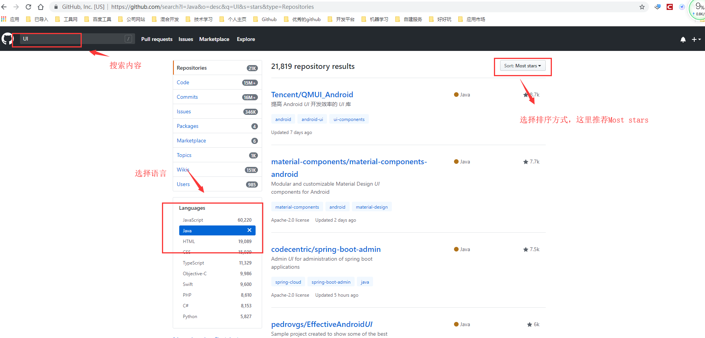

# 你真的会使用github吗？

> github作为全球最大的开源软件托管平台，自2008年上线以来，一直吸引了无数的程序开发者在上面开源分享自己的项目代码。尤其是在微软收购github之后，更是吸引了很多非程序开发者将自己的知识和经验通过平台分享出来，可以说github是一个蕴藏了无数价值和宝藏的大宝库。然而，对于这样一个极具价值的平台，你真的会使用吗？

## github的价值

github极具价值，下面我简单列举几点：

* 存放自己的项目代码和文件

* 解决实际工作中遇到的问题

* 借鉴别人的知识和经验，提升自我的能力

* 提供学习交流的场所

* 搭建自己的博客

* 提升自身行业的影响力和地位

---

## 如何使用github

### 一、如何使用github进行项目管理

1.首先，你得明确需要上传github的项目内容。这里我要特别提醒，你可别提交与公司相关的内容，你可是签过保密协议的，提交的内容要慎重，尽量避开与公司相关的内容。即使你想提交，也务必自己重写一个，当然公司核心的内容你就别提交了，重写也不行，违规的事情咱不能做。

2.在提交项目前，你得先了解`git`指令，因为在github上的所有操作都是通过`git`指令完成的，这里我有一篇[Git 常用命令](https://blog.csdn.net/xuexiangjys/article/details/79875167)可供参考。

3.了解完`git`指令后，下面就是开始上传项目代码了，这里我有一篇[如何使用Git命令提交项目代码](https://blog.csdn.net/xuexiangjys/article/details/79874571)可供参考。

4.对于项目的管理操作，可以借鉴一下网上的[GitHub项目管理基本操作](https://blog.csdn.net/weixin_41424247/article/details/78998916).这里，你需要了解的内容包括：

* 主干(master)和分支(branch)
* 合并请求(Pull Request和Merge)
* 打标签(tag)和发布(release)
* 项目介绍(README.md)
* 知识库(wiki)
* 问题建议(issues)
* 项目计划(projects).

### 二、如何通过github解决实际工作中遇到的问题

1.先确定问题涉及技术的关键词。

2.使用github的[搜索功能](https://github.com/search)进行搜索。对结果我们可以通过语言(Languages)和收藏数(Most stars)进行排序筛选,如下图所示：

3.选择目标参考的项目。选择开源项目一般有以下几点考量因素：

* 项目的star量：越多越好。
* 项目的活跃度：这里考量的因素包含issue的总体数量、open issue和closed issue的数量、issue回复和解决的速度。
* 文档是否齐全：是否有wiki或者README.md
* 项目代码的质量：设计是否合理，是否符合设计模式原则，考虑项目的可扩展性、便利性和稳定性。
* 开源作者的水平：作者其他项目的star量和行业影响力。
* 注意开源协议，以免不必要的麻烦。

4.确定了参考的项目后，下面就是如何使用别人的开源项目。

（1）先仔细阅读项目介绍（README.md），大体上了解项目的内容。

（2）了解如何引用和使用。你可以通过阅读项目介绍（README.md）或者wiki获得。

（3）如果项目比较大的话，建议参考项目的demo源码。

5.出问题了如何解决。【这步很关键】

> 使用别人的开源项目，难免需求会有些出入，当然也会遇到一些未知的bug，这很正常。下面我将逐步介绍解决问题的步骤。

（1）再回头仔细阅读README.md和wiki，确保自己没有误使用。

（2）如果项目有【常见问题】这一项，先看一下能否解决自己的问题。

（3）提取问题的关键字，在项目的issue中进行搜索，查看有无可解决的方案，这一点很重要，开源者一般都很讨厌别人提一些重复性的issue。

（4）确保你出现的问题，别人都没有提过的情况下，尝试提issue。这里注意将issue的内容描述清楚，如果项目提供issue模板的话就按要求认真填写，开源者没时间在那里揣测你的想法，这样能解决大家的时间。

（5）如果你提的issue作者一直不回复的话，这时候有三条路给你选择：

* 看项目README.md最后有没有交流群或者作者的联系方式，加入后直接反应问题。

* fork项目，直接修改源码，自己解决问题。如果你想将自己修改后的代码上传代码仓库的话，这里有一篇文章可供参考:[手把手教你使用Gradle脚本上传代码仓库](https://blog.csdn.net/xuexiangjys/article/details/80160954)

* 放弃该项目，找一个更适合自己的项目。

### 三、如何通过github借鉴别人的知识和经验，提升自我的能力

### 四、如何通过github搭建自己的博客

### 五、如何通过github提升自身行业的影响力和地位
