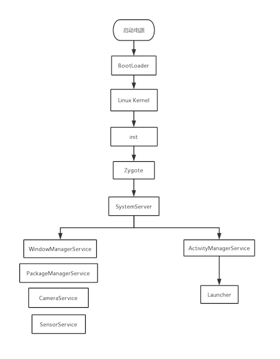

# Android系统启动

> 其实Android系统的启动最主要的内容无非是init、Zygote、SystemServer这三个进程的启动，他们一起构成的铁三角是Android系统的基础。

## 启动大纲

1. 启动电源以及引导程序加载
2. 引导程序BootLoader启动
3. Linux内核启动
4. init进程启动
5. Zygote进程启动
6. SystemServer进程启动
7. Launcher启动

## 启动流程图

---

## 启动详解

### init进程启动的准备工作

> init进程是在Linux内核加载完成后启动的，因此要想启动init进程，必须先加载Linux内核，而Linux则是由引导程序BootLoader拉起来的。

* 当电源被按下后，引导芯片代码（ROM）执行，并将引导程序BootLoader加载到RAM中执行。

* BootLoader运行，它的作用就是把系统OS拉起来并运行。

* Linux内核被拉起运行后，会设置缓存、被保护存储器、计划列表、加载驱动等，最后会在系统文件中寻找init.rc文件，启动init进程。

### init进程启动

> init进程主要用于初始化和启动属性服务，并启动Zygote进程。init进程的源码在[system/core/init/init.cpp](http://androidxref.com/9.0.0_r3/xref/system/core/init/init.cpp)`下。

* 创建和挂载启动所需要的文件目录（tmpfs、devpts、proc、sysfs和selinuxfs），他们都是系统运行时目录。

* 初始化并启动属性服务（类似window里面的注册表）。

* 解析[init.rc](http://androidxref.com/9.0.0_r3/xref/system/core/rootdir/init.rc)配置文件。

* 启动Zygote进程。

### Zygote进程启动

> 在Android系统中，DVM和ART、应用程序进程以及运行系统的关键服务SystemServer进程都是由Zygote进程来创建的，我们也可以将其称为孵化器。它通过fork的形式来创建应用程序进程和SystemServer进程。

* init进程调用[app_main](http://androidxref.com/9.0.0_r3/xref/frameworks/base/cmds/app_process/app_main.cpp)创建了[AndroidRuntime](http://androidxref.com/9.0.0_r3/xref/frameworks/base/core/jni/AndroidRuntime.cpp),通过调用它的start方法来启动Zygote。

* 在[AndroidRuntime](http://androidxref.com/9.0.0_r3/xref/frameworks/base/core/jni/AndroidRuntime.cpp)中创建了Java虚拟机，并为其注册了JNI方法

* 通过JNI反射调用[ZygoteInit](http://androidxref.com/9.0.0_r3/xref/frameworks/base/core/java/com/android/internal/os/ZygoteInit.java)进入Zygote的Java框架层，最终启动了Zygote进程。

#### ZygoteInit的main方法

> 这里需要注意的是，之前的所以初始化操作都是在Native层进行的，直到我们通过JNI调用ZygoteInit的main方法后，我们才进入了Java框架层。

* 创建了一个Server端的socket(主要用于跨进程通信)。

* 预加载类和资源。

* 启动SystemServer进程。

* 等待AMS（ActivityManagerService）请求创建新的应用程序进程。

### SystemServer进程启动

> SystemServer进程主要用于创建和启动系统服务，包括我们常用的AMS、WMS和PMS等。

* 启动Binder线程池，用于与其他进程进行通信。

* 创建[SystemServiceManager](http://androidxref.com/9.0.0_r3/xref/frameworks/base/services/core/java/com/android/server/SystemServiceManager.java)，其用于对系统的服务进行创建、启动和生命周期的管理。

* 启动各种系统服务（引导服务、核心服务和其他服务等）

### Launcher启动

> Launcher通俗地说就是Android系统的桌面，是系统的门户，用于启动应用程序，其本质就是一个Activity,类名为"com.android.launcher3.Launcher",[点击查看Launcher的AndroidManifest.xml](http://androidxref.com/9.0.0_r3/xref/packages/apps/Launcher3/AndroidManifest.xml)。

* [SystemServer](http://androidxref.com/9.0.0_r3/xref/frameworks/base/services/java/com/android/server/SystemServer.java)调用[AMS](http://androidxref.com/9.0.0_r3/xref/frameworks/base/services/core/java/com/android/server/am/ActivityManagerService.java#15122)的`systemReady`方法准备启动Launcher

* AMS中又会调用ActivityStackSupervisor和ActivityStack进行一系列的准备工作，最终又调用了AMS的startHomeActivityLocked方法，使用[ActivityStarter](http://androidxref.com/9.0.0_r3/xref/frameworks/base/services/core/java/com/android/server/am/ActivityStarter.java)的startHomeActivityLocked启动Launcher。

