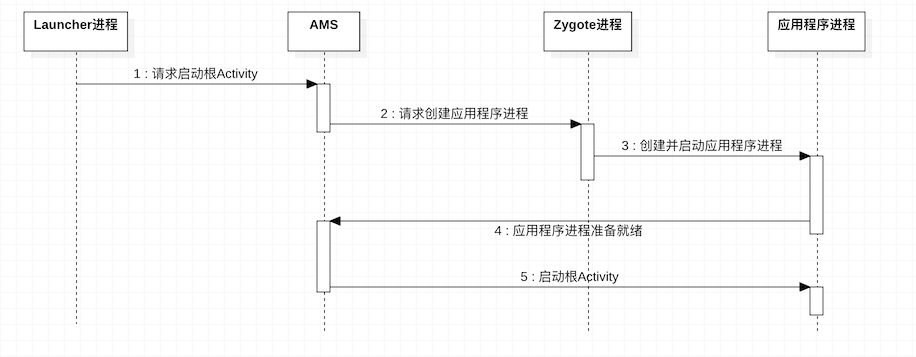
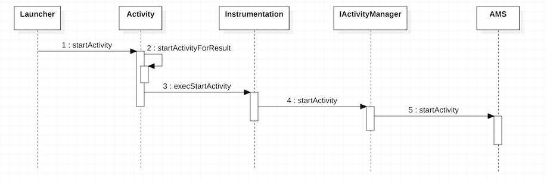
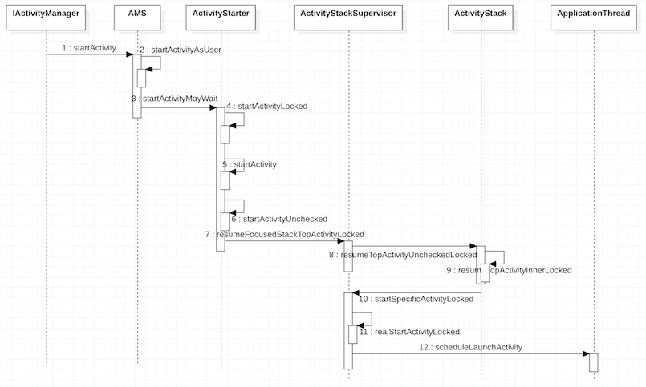
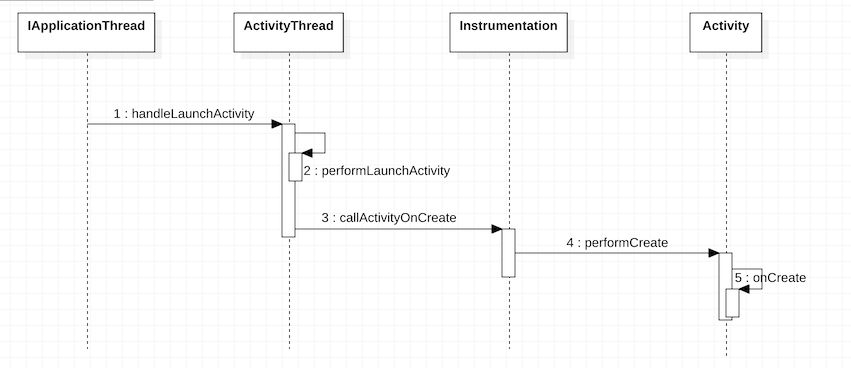
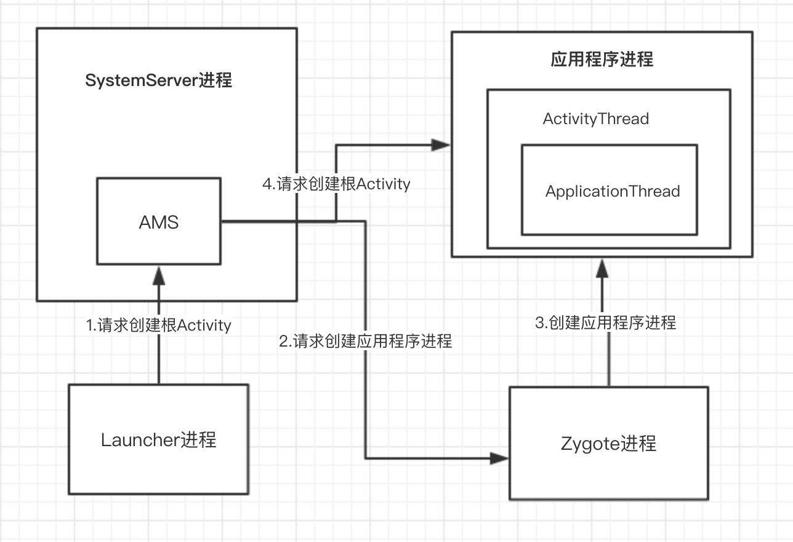

# 应用程序（App)启动

> 应用程序的启动，又可称为根Activity的启动。

## 启动大纲

1. Launcher请求AMS。

2. AMS请求ApplicationThread。

3. ActivityThread启动Activity。

## 启动时序图

---

### Launcher请求AMS

* 当我们点击应用程序的图标时，就会自动调用[Launcher](http://androidxref.com/9.0.0_r3/xref/packages/apps/Launcher3/src/com/android/launcher3/Launcher.java#1667)的`startActivitySafely`方法, 最终会调用[Activity](http://androidxref.com/9.0.0_r3/xref/frameworks/base/core/java/android/app/Activity.java#4899)的`startActivity`方法。

* 在Activity的`startActivity`中又调用了`startActivityForResult`方法，而`startActivityForResult`方法内部又调用了[Instrumentation](http://androidxref.com/9.0.0_r3/xref/frameworks/base/core/java/android/app/Instrumentation.java#1635)的`execStartActivity`方法。

* 在Instrumentation的`execStartActivity`方法中又通过[ActivityManager](http://androidxref.com/9.0.0_r3/xref/frameworks/base/core/java/android/app/ActivityManager.java#4125)的`getService`方法获取了IBinder类型的AMS引用`IActivityManager`，最后调用了[AMS](http://androidxref.com/9.0.0_r3/xref/frameworks/base/services/core/java/com/android/server/am/ActivityManagerService.java#5079)的`startActivity`方法。

### AMS请求ApplicationThread

* 在AMS的`startActivity`方法中，又调用了其本身的`startActivityAsUser`方法，进行权限的检查。

* 权限检查完后，调用[ActivityStarter](http://androidxref.com/9.0.0_r3/xref/frameworks/base/services/core/java/com/android/server/am/ActivityStarter.java#945)的`startActivityMayWait`方法，并在该方法中解析处理应用程序需要的参数，并进行相关参数的初始化，最终会调用其`startActivity`方法。而在`startActivity`方法中又调用了`startActivityUnchecked`方法来处理与栈管理相关的逻辑。

* 在处理完栈的关系后，紧接着会调用[ActivityStackSupervisor](http://androidxref.com/9.0.0_r3/xref/frameworks/base/services/core/java/com/android/server/am/ActivityStackSupervisor.java#2214)的`resumeFocusedStackTopActivityLocked`方法获取需要启动的Activity所在栈的栈顶。

* 当需要启动的Activity的状态不是RESUMED状态，就需要调用[ActivityStack](http://androidxref.com/9.0.0_r3/xref/frameworks/base/services/core/java/com/android/server/am/ActivityStack.java#2282)的`resumeTopActivityUncheckedLocked`方法，而它的内部又调用了`resumeTopActivityInnerLocked`方法进行一系列的栈状态的判断，最终又回调了ActivityStackSupervisor的`startSpecificActivityLocked`方法。

* 在[ActivityStackSupervisor](http://androidxref.com/9.0.0_r3/xref/frameworks/base/services/core/java/com/android/server/am/ActivityStackSupervisor.java#1678)的`startSpecificActivityLocked`方法中先是获取了即将启动的Activity所在的应用程序进程（就是在这个地方判断应用所在进程是否存在且已启动，如果没有启动，就需要启动应用程序进程），然后调用`realStartActivityLocked`方法。

* 在[ActivityStackSupervisor](http://androidxref.com/9.0.0_r3/xref/frameworks/base/services/core/java/com/android/server/am/ActivityStackSupervisor.java#1377)的`realStartActivityLocked`方法中，对启动的应用程序进程进行一系列的判断和处理，最终会调用IBinder类型的ApplicationThread引用`IApplicationThread`，通过传入`IApplicationThread`建立`ClientTransaction`，加入执行`LaunchActivityItem`任务，最终实现跨进程执行调用[ActivityThread](http://androidxref.com/9.0.0_r3/xref/frameworks/base/core/java/android/app/ActivityThread.java#3024)的`handleLaunchActivity`方法。

### ActivityThread启动Activity

* 在ActivityThread调用了它的`handleLaunchActivity`方法中，会先调用其`performLaunchActivity`方法，之后调用`handleResumeActivity`，将Activity的状态置为Resume。

* 在ActivityThread的[performLaunchActivity](http://androidxref.com/9.0.0_r3/xref/frameworks/base/core/java/android/app/ActivityThread.java#2808)方法中做了很多事情。

1. 首先，执行了`createBaseContextForActivity`方法，创建要启动Activity的上下文；
2. 其次，调用执行了Instrumentation的`newActivity`方法来创建Activity实例；
3. 接着，调用[LoadedApk](http://androidxref.com/9.0.0_r3/xref/frameworks/base/core/java/android/app/LoadedApk.java#1037)的`makeApplication`方法，创建应用程序的Application;
4. 之后，调用需要启动的Activity的`attach`方法初始化Activity，创建Window对象并与Activity自身进行关联。
5. 最后，调用执行了[Instrumentation](http://androidxref.com/9.0.0_r3/xref/frameworks/base/core/java/android/app/Instrumentation.java#1282)的`callActivityOnCreate`方法来启动Activity。

* 在Instrumentation执行了`callActivityOnCreate`方法中，会调用[Activity](http://androidxref.com/9.0.0_r3/xref/frameworks/base/core/java/android/app/Activity.java#7130)的`performCreate`方法，最终会调用Activity的`onCreate`方法，这样应用程序也就启动了。

---

## 应用程序启动的进程关系图

> 应用程序启动的过程中，主要涉及了Launcher进程、SystemServer进程、Zygote进程和应用程序进程这四个进程，它们之间的关系如下。

