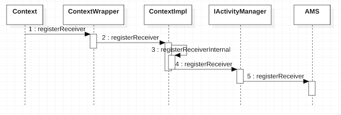
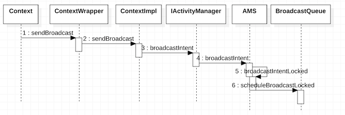
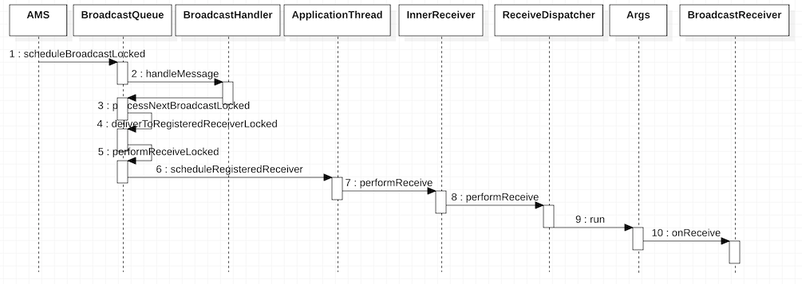

# 广播的注册、发送和接收过程

> 广播的注册、发送和接收都与AMS有着密不可分的关系。

## 广播的注册

> 广播的注册可分为静态注册和动态注册两种，静态注册在应用安装时由`PackageManagerService`来完成注册过程，下面我主要来分析动态广播注册。

### ContextImpl请求AMS注册广播

* 当我们需要动态注册广播时，需要调用Context的`registerReceiver`方法，然后在[ContextWrapper](http://androidxref.com/9.0.0_r3/xref/frameworks/base/core/java/android/content/ContextWrapper.java#621)的`registerReceiver`中调用[ContextImpl](http://androidxref.com/9.0.0_r3/xref/frameworks/base/core/java/android/app/ContextImpl.java#105)的`registerReceiver`方法，最终会调用其[registerReceiverInternal](http://androidxref.com/9.0.0_r3/xref/frameworks/base/core/java/android/app/ContextImpl.java#1467)方法。

* 在ContextImpl的`registerReceiverInternal`方法中，首先是和服务绑定类似的，通过`LoadedApk`类型的mPackageInfo对象的`getReceiverDispatcher`方法来获取`IIntentReceiver`类型的rd对象，用于广播的跨进程通信。然后调用IActivityManager的`registerReceiver`方法，最终调用AMS的`registerReceiver`方法，并将`IIntentReceiver`类型的rd对象传入。

* 在AMS的[registerReceiver](http://androidxref.com/9.0.0_r3/xref/frameworks/base/services/core/java/com/android/server/am/ActivityManagerService.java#20801)方法中，首先是调用`getRecordForAppLocked`方法获取调用注册广播的应用程序进程信息，然后根据进程信息获取对应在AMS中存储的所有粘性广播的intent，然后和传入的参数filter的粘性广播进行对比，找到所有匹配的intent存入到allSticky列表中，最终加入到广播队列中执行。

* 除此之外，在AMS的`registerReceiver`中还调用了HashMap类型，存放了所有应用进程的广播接收者列表mRegisteredReceivers，通过传入之前的`IIntentReceiver`对象获取到对应的广播接收者列表ReceiverList，并将其传入创建BroadcastFilter，用以描述注册的广播接收者。最后将BroadcastFilter添加到IntentResolver类型的mReceiverResolver中，这样当AMS接收到广播时，就可以从mReceiverResolver中直接找到对应的广播接收者，从而达到注册广播的目的。

## 广播的发送

> 广播可以发送多种类型，包括无序广播（普通广播）、有序广播和粘性广播。

Android广播的分类：

1、 普通（无序）广播：使用`sendBroadcast`发送广播。这种广播可以依次传递给各个处理器去处理。

2、 有序广播：使用`sendOrderedBroadcast`发送广播。这种广播在处理器端的处理顺序是按照处理器的不同优先级来区分的，高优先级的处理器会优先截获这个消息，并且可以将这个消息删除。

3、 粘性消息：使用`sendStickyBroadcast`发送广播。粘性消息在发送后就一直存在于系统的消息容器里面，等待对应的处理器去处理，如果暂时没有处理器处理这个消息则一直在消息容器里面处于等待状态，粘性广播的Receiver如果被销毁，那么下次重建时会自动接收到消息数据。

注意：普通广播和粘性消息不能被截获，而有序广播是可以被截获的。

这里我们以最简单的普通广播发送为例进行分析。

### ContextImpl请求AMS发送广播

* 当我们需要发送无序广播时，需要调用Context的`sendBroadcast`方法，然后在[ContextWrapper](http://androidxref.com/9.0.0_r3/xref/frameworks/base/core/java/android/content/ContextWrapper.java#443)的`sendBroadcast`中调用[ContextImpl](http://androidxref.com/9.0.0_r3/xref/frameworks/base/core/java/android/app/ContextImpl.java#1004)的`sendBroadcast`方法，最终会调用AMS的[broadcastIntent](http://androidxref.com/9.0.0_r3/xref/frameworks/base/services/core/java/com/android/server/am/ActivityManagerService.java#21929)方法。

* 在AMS的`broadcastIntent`方法中，首先对发送的广播进行合法性校验，然后调用其[broadcastIntentLocked](http://androidxref.com/9.0.0_r3/xref/frameworks/base/services/core/java/com/android/server/am/ActivityManagerService.java#21207)方法。

* 在AMS的`broadcastIntentLocked`方法中做了很多事情，对广播做了一系列的处理后，最终调用`broadcastQueueForIntent`构建了广播队列，然后新建BroadcastRecord对象并将其传入广播队列中，同时执行广播队列的[scheduleBroadcastLocked](http://androidxref.com/9.0.0_r3/xref/frameworks/base/services/core/java/com/android/server/am/BroadcastQueue.java#386)方法。

## 广播的接收

### AMS到BroadcastReceiver接收广播

* 在BroadcastQueue的`scheduleBroadcastLocked`方法中，发送了类型为BROADCAST_INTENT_MSG类型的消息，并在消息处理中最终调用了其[processNextBroadcastLocked](http://androidxref.com/9.0.0_r3/xref/frameworks/base/services/core/java/com/android/server/am/BroadcastQueue.java#processNextBroadcastLocked)方法，并在其中遍历存储了无序广播的列表，然后调用`deliverToRegisteredReceiverLocked`将这些无序广播的信息描述发送给对应的广播接收者。

* 在BroadcastQueue的`deliverToRegisteredReceiverLocked`方法中主要检查广播发送者和广播接收者的权限，并最终会调用其[performReceiveLocked](http://androidxref.com/9.0.0_r3/xref/frameworks/base/services/core/java/com/android/server/am/BroadcastQueue.java#performReceiveLocked)方法，然后在其方法中调用ApplicationThread的[scheduleRegisteredReceiver](http://androidxref.com/9.0.0_r3/xref/frameworks/base/core/java/android/app/ActivityThread.java#981)方法。

* 在ApplicationThread的`scheduleRegisteredReceiver`方法中会调用`IIntentReceiver`类型的对象receiver的performReceive方法，而`IIntentReceiver`是Binder通信的客户端，[InnerReceiver](http://androidxref.com/9.0.0_r3/xref/frameworks/base/core/java/android/app/LoadedApk.java#1279)在本地的代理，它会调用InnerReceiver的`performReceive`方法，最终会调用`ReceiverDispatcher`的[performReceive](http://androidxref.com/9.0.0_r3/xref/frameworks/base/core/java/android/app/LoadedApk.java#1467)方法。

* 在ReceiverDispatcher的`performReceive`方法中，会构建类型为[Args](http://androidxref.com/9.0.0_r3/xref/frameworks/base/core/java/android/app/LoadedApk.java#1336)类型的对象，最终通过mActivityThread(H)，将Args对象的getRunnable方法获取的Runnable发送到线程的消息队列中执行。在Args对象的Runnable方法中会调用BroadcastReceiver类型的receiver对象的`onReceive`方法，这样注册的广播接收者就收到了广播并得到了intent。