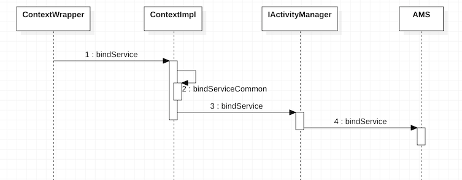
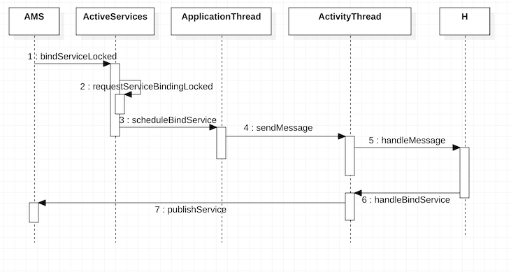
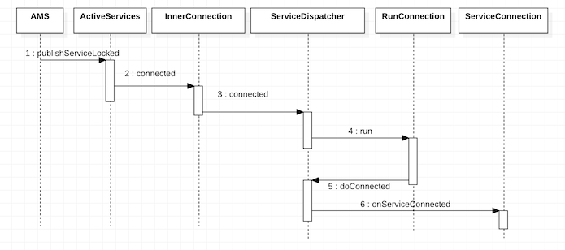

# Service的绑定过程

> 除了使用Context的startService来启动Service外，我们也可以通过Context的bindService来绑定Service。绑定Service的过程要比启动Service的过程复杂一些。不清楚[Service启动](./ServiceStartup.md)的可以点击了解一下。

## 启动大纲

1. ContextImpl请求AMS绑定Service.

2. AMS请求ActivityThread处理Service绑定.

3. AMS进行Service的绑定.

---

### ContextImpl请求AMS绑定Service

* 当我们需要绑定一个Service时，我们会使用`context.bindService`。而Context只是一个抽象的类，它的实现是在[ContextWrapper](http://androidxref.com/9.0.0_r3/xref/frameworks/base/core/java/android/content/ContextWrapper.java#696)中。

* 在ContextWrapper的`bindService`方法中，又会调用其内部的Context类型的mBase变量，而该变量的创建详见[ActivityThread](http://androidxref.com/9.0.0_r3/xref/frameworks/base/core/java/android/app/ActivityThread.java#2990)的`createBaseContextForActivity`方法，它的实现类是`ContextImpl`。

* 在[ContextImpl](http://androidxref.com/9.0.0_r3/xref/frameworks/base/core/java/android/app/ContextImpl.java#1609)的`bindService`方法中，又会调用其自身的`bindServiceCommon`方法。

* 在[ContextImpl](http://androidxref.com/9.0.0_r3/xref/frameworks/base/core/java/android/app/ContextImpl.java#1651)的`bindServiceCommon`方法中，首先调用[LoadedApk](http://androidxref.com/9.0.0_r3/xref/frameworks/base/core/java/android/app/LoadedApk.java#1492)的`getServiceDispatcher`方法获取ServiceConnection的封装类(本地的代理)`IServiceConnection`(用于跨进程通信)，然后使用`ActivityManager`获取AMS的代理`IActivityManager`，调用其`bindService`方法并将`IServiceConnection`对象传入。

### AMS请求ActivityThread处理Service绑定

* [AMS](http://androidxref.com/9.0.0_r3/xref/frameworks/base/services/core/java/com/android/server/am/ActivityManagerService.java#20492)的`bindService`方法中调用方法中调用[ActiveService](http://androidxref.com/9.0.0_r3/xref/frameworks/base/services/core/java/com/android/server/am/ActiveServices.java#1428)的`bindServiceLocked`方法，其中同样的和`startServiceLocked`一样调用`retrieveServiceLocked`用于获取启动服务的Intent参数所对应的`ServiceRecord`，然后调用[ServiceRecord](http://androidxref.com/9.0.0_r3/xref/frameworks/base/services/core/java/com/android/server/am/ServiceRecord.java#503)的`retrieveAppBindingLocked`方法来获取应用和服务的绑定信息`AppBindRecord`。然后调用`requestServiceBindingLocked`方法，将之前获取的`AppBindRecord`信息传入，来发出服务绑定的请求。

* 除此之外，在`bindServiceLocked`方法调用`requestServiceBindingLocked`请求绑定前，还调用了`bringUpServiceLocked`方法去启动服务。

* 在[ActiveService](http://androidxref.com/9.0.0_r3/xref/frameworks/base/services/core/java/com/android/server/am/ActiveServices.java#requestServiceBindingLocked)的`requestServiceBindingLocked`方法中最终会调用`ActivityThread`的[scheduleBindService](http://androidxref.com/9.0.0_r3/xref/frameworks/base/core/java/android/app/ActivityThread.java#scheduleBindService)方法，然后封装BindServiceData数据并将其传入`sendMessage`方法中，向H发送`BIND_SERVICE`消息。在H对应的消息处理中会调用[handleBindService](http://androidxref.com/9.0.0_r3/xref/frameworks/base/core/java/android/app/ActivityThread.java#handleBindService)方法。在`handleBindService`方法中，对未绑定服务的，先后调用Service的`onBind`方法和AMS的[publishService](http://androidxref.com/9.0.0_r3/xref/frameworks/base/services/core/java/com/android/server/am/ActivityManagerService.java#20518)方法；对已绑定服务的，先后调用Service的`onRebind`方法和AMS的[serviceDoneExecuting](http://androidxref.com/9.0.0_r3/xref/frameworks/base/services/core/java/com/android/server/am/ActivityManagerService.java#20543)方法。

* 在AMS的[publishService](http://androidxref.com/9.0.0_r3/xref/frameworks/base/services/core/java/com/android/server/am/ActivityManagerService.java#20518)方法中又调用了`ActiveService`的[publishServiceLocked](http://androidxref.com/9.0.0_r3/xref/frameworks/base/services/core/java/com/android/server/am/ActiveServices.java#1699)方法。

* 在`publishServiceLocked`方法中会调用`IServiceConnection`的`connected`方法来建立服务连接，最终会调用执行`LoadApk`中的[RunConnection](http://androidxref.com/9.0.0_r3/xref/frameworks/base/core/java/android/app/LoadedApk.java#1753)任务，执行[doConnected](http://androidxref.com/9.0.0_r3/xref/frameworks/base/core/java/android/app/LoadedApk.java#doConnected)方法建立服务绑定连接。

### 与Service绑定相关的对象类型介绍：

* ServiceRecord：用于描述一个Service。

* ProcessRecord：一个进程所包含的信息。

* ConnectionRecord：用于描述应用程序进程和Service建立的一次通信。

* AppBindRecord: 用于维护Service与应用进程之间的绑定信息。

* IntentBindRecord：用于描述绑定Service的Intent信息。

