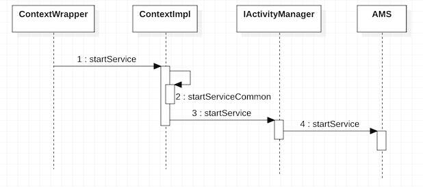
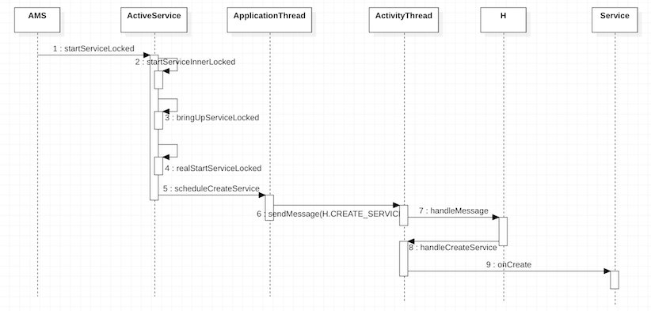

# Service的启动过程

> Service的启动和根Activity的启动很类似。Service的启动同样需要保证该应用程序的进程已经被启动。

## 启动大纲

1. ContextImpl请求AMS启动Service.

2. AMS请求ActivityThread启动Service.

---

### ContextImpl请求AMS启动Service

* 当我们需要启动一个Service时，我们会使用`context.startService`。而Context只是一个抽象的类，它的实现是在[ContextWrapper](http://androidxref.com/9.0.0_r3/xref/frameworks/base/core/java/android/content/ContextWrapper.java#663)中。

* 在ContextWrapper的`startService`方法中，又会调用其内部的Context类型的mBase变量，而该变量的创建详见[ActivityThread](http://androidxref.com/9.0.0_r3/xref/frameworks/base/core/java/android/app/ActivityThread.java#2990)的`createBaseContextForActivity`方法，它的实现类是`ContextImpl`。

* 在[ContextImpl](http://androidxref.com/9.0.0_r3/xref/frameworks/base/core/java/android/app/ContextImpl.java#1530)的`startService`方法中，又会调用其自身的`startServiceCommon`方法。

* 在[ContextImpl](http://androidxref.com/9.0.0_r3/xref/frameworks/base/core/java/android/app/ContextImpl.java#1557)的`startServiceCommon`方法中，会使用`ActivityManager`获取AMS的代理`IActivityManager`，并调用其`startService`方法。

### AMS请求ActivityThread启动Service

* [AMS](http://androidxref.com/9.0.0_r3/xref/frameworks/base/services/core/java/com/android/server/am/ActivityManagerService.java#20342)的`startService`方法中调用[ActiveService](http://androidxref.com/9.0.0_r3/xref/frameworks/base/services/core/java/com/android/server/am/ActiveServices.java#389)的`startServiceLocked`方法，其中调用`retrieveServiceLocked`用于获取启动服务的Intent参数所对应的`ServiceRecord`,它主要用于描述一个Service，启动Service所必须的参数。

* 在ActiveService的`startServiceLocked`方法中获取到相应的`ServiceRecord`之后，就会调用其自身的[startServiceInnerLocked](http://androidxref.com/9.0.0_r3/xref/frameworks/base/services/core/java/com/android/server/am/ActiveServices.java#660)方法，而它又会去调用`bringUpServiceLocked`方法。在[bringUpServiceLocked](http://androidxref.com/9.0.0_r3/xref/frameworks/base/services/core/java/com/android/server/am/ActiveServices.java#2287)方法中主要做了以下三个工作：

（1）获取Service运行所在的进程。

（2）如果Service运行所在的应用程序进程`ProcessRecord`存在，则调用其自身的`realStartServiceLocked`方法来启动Service.

（3）如果Service运行所在的应用程序进程`ProcessRecord`不存在，则需要调用AMS的`startProcessLocked`方法来启动应用程序进程。

* 在[ActiveService](http://androidxref.com/9.0.0_r3/xref/frameworks/base/services/core/java/com/android/server/am/ActiveServices.java#2433)的`realStartServiceLocked`方法中，会使用`ProcessRecord`的`IApplicationThread`类型的引用（实现类是ActivityThread的内部类ApplicationThread），调用其[scheduleCreateService](http://androidxref.com/9.0.0_r3/xref/frameworks/base/core/java/android/app/ActivityThread.java#805)方法。

* 在ActivityThread的`scheduleCreateService`方法中，会向其内部类并继承自Handler的`H`发送`CREATE_SERVICE`消息，并由`H`进行处理，最终会调用`handleCreateService`方法。

* 在[ActivityThread](http://androidxref.com/9.0.0_r3/xref/frameworks/base/core/java/android/app/ActivityThread.java#3503)的`handleCreateService`方法中主要做了如下几件事:

（1）获取要启动Service的应用程序的LoadApk（包信息），并通过它获取类的加载器，通过反射创建Service的实例。

（2）调用`ContextImpl`的`createAppContext`方法，为Service创建上下文环境ContextImpl对象。

（3）调用`Service`的`attach`方法，对Service进行初始化。

（4）调用`Service`的`onCreate`方法，这样Service就启动了。

