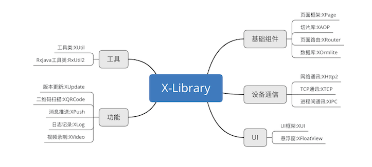

# X-Library系列详解

> 自2017年初开始，我就致力于Android应用框架的研究，到2018年开始在Github上陆续开源系列作品，再到2019年收获我的第一个star过千的项目，期间我付出了很多，失去了很多，同时也获得了很多。

## 前言

为了能够让更多的人了解到我的开源项目，我也是使出了浑身解数，写了不少文章和文档来提高项目的曝光率，不过在这期间我也发现了不少问题：读者的水平参差不齐，以往我写的文章都是建立在有一定开发基础之上的，这就导致了很多新手小白、学生党看不懂，不会用，瞎折腾，这完全违背了我的初衷。我希望我的开源项目不仅能够服务那些有一定开发经验的人，还能帮助那些热爱Android的人学习并提升自己的开发水平，早日能够跟上我们的步伐。

在接下来的数月里，我将一一详细讲解我开源的几个热门项目，介绍他们所使用的场景，解决的问题以及分析其中实现的逻辑。

## 概述

> 所有的技术框架都必须服务于实际生产，否则就是耍流氓。

我一直认为这世上没有绝对完美的事物，当然技术也并不例外。在做Android的最初几年里，我一直认为技术是产品的灵魂，用于创造产品而又高于产品，是无可替代的，这也是我初期为何执着于技术的原因。渐渐地，当一项技术趋于成熟的时候，你会发现其实技术也并不是想象中的那么重要，同样的功能或是产品，你可以用2种或者更多的技术方案来实现，这个时候你才会发现，原来技术也如同资本、人力、市场和物料等资源，只是我们实现目的的工具而已。

其实`X-Library`正是我早期做Android开发过程中积累沉淀下来的技术经验，并通过我后期不断完善之后形成的。虽说可能不及大厂和google爸爸他们开源的项目那么牛掰，不过相信我，这些框架都是在实际生产中诞生出来的优秀项目，相比大厂和google爸爸他们开源的项目，他们可能更适合中小企业或者独立开发者的你使用哦！

下面是`X-Library`的思维导图：

* 基础组件
    * [页面框架：XPage](#xpage)
    * [AOP切片库：XAOP](#xaop)
    * [页面路由：XRouter](#xrouter)
    * [数据库：XOrmlite](#xormlite)
* 信息通讯
    * [网络通讯：XHttp2](#xhttp2)
    * [TCP通讯：XTCP](#xtcp)
    * [进程通讯：XIPC](#xipc)
* UI组件
    * [UI框架：XUI](#xui)
    * [悬浮窗：XFloatView](#xfloatview)
* 功能库
    * [版本更新：XUpdate](#xupdate)
    * [二维码扫描：XQRCode](#xqrcode)
    * [消息推送：XPush](#xpush)
    * [日志记录：XLog](#xlog)
    * [视频录制：XVideo](#xvideo)
* 工具
    * [工具类：XUtil](#xutil)
    * [RxJava工具类：RxUtil2](#rxutil2)

---

## Library简介

### XPage

> 一个非常方便的fragment页面框架

XPage是我开源的第一个项目，也是最实用、最方便的项目之一。设计的初衷是希望能做一个通用的Activity作为壳，Fragment作为页面填充展示，并且能够实现自由的切换和数据交互。

#### 设计原由

当初做Android开发时每当我写一个页面，都需要创建一个Activity，并且还需要在manifest中注册一堆Activity信息，这样既不方便，而且对资源的开销也比较大。因此当时我就设想能否创造出一个通用万能的Activity容器，可以全权负责Fragment的切换展示和数据交互，只需要一行代码即可完成所有的操作，还不需要自己手动去注册，可以一键生成。

#### 设计思路

刚开始的时候真的很难，没有什么好的思路，最初只是简单封装了一个Activity，通过传入一些key值从而获取并加载对应的fragment，类似`ARouter`中Fragment发现那种。其实这样做并没有解决一个容器的问题，而且页面切换也不是很灵活，不够通用，使用起来也不是很方便。

突然有一天我发现Github上有个开源项目[CorePage](https://github.com/lizhangqu/CorePage/)写得非常好，完美地解决了我对一个Activity容器的问题，于是我决定仔细研究其代码，并在其基础上设计出了XPage的最初版本。

就在XPage正式投入使用的过程中，我发现还是存在不少问题的：

* 1.对外API不够灵活，使用起来不够方便；

* 2.每个Fragment仍需要手动注册，很麻烦；

对于API不够灵活的问题，我在之后的版本中陆续通过构造者模式设计以及Android主题属性等手段解决了。

而对于手动注册的问题，我正是借鉴了ARouter的思路，通过Android APT技术，从而实现了Fragment信息的自动注册。

#### 解决痛点

* 只需要一个Activity容器就可以实现多个页面的交互。

* Fragment自由切换和数据交互。

* 无需在manifest中注册一堆Activity信息，通过@Page注解一键自动注册。

#### 项目地址

https://github.com/xuexiangjys/XPage

---

### XAOP

> 一个轻量级的AOP(Android)应用框架。囊括了最实用的AOP应用。

XAOP是我刚接触到AOP(面向切片编程)思想后，灵光乍现编写的应用库，应该说是我使用得最多的库了，因为有了它，编码真的很方便！

#### 设计原由

在我们平时开发的过程中，一定会遇到权限申请、线程切换、数据缓存、异常捕获、埋点和方法执行时间统计等问题。这些都是非常常见的问题，实现起来也不是很难，不过就是太麻烦了，还会让程序多出很多重复性、模版化的代码。

#### 设计思路

让我最初接触到AOP思想的是JakeWharton的[hugo](https://github.com/JakeWharton/hugo),通过阅读它的源码之后，让我对`aspectj`这项技术的动态代码编织深深地着了迷。之后我详细研究了`aspectj`相关的技术，并不断搜集AOP在Android上的典型应用场景，然后通过`aspectj`这项技术去逐一实现。最后就成就了XAOP这个库。

#### 解决痛点

* 可以解决快速点击的问题
* 解决Android6.0以上动态权限申请的问题
* 线程自由切换的问题
* 日志埋点问题
* 缓存问题（磁盘缓存和内存缓存）
* 异常捕获处理
* 业务拦截（登陆验证、有效性验证等）

#### 项目地址

https://github.com/xuexiangjys/XAOP

---

### XUI

> 一个简洁而又优雅的Android原生UI框架，解放你的双手！

XUI可以说是我花费心血最多的开源项目了，目前稍微大一点的项目我都会选择引入它。XUI几乎涵盖了目前Android开发所需要的所有组件，可以说有了XUI之后，可以大大提高我们的开发效率，让我们可以将精力很多地放在业务功能和数据处理上。可以说XUI是目前Github上组件最全、文档最详细、案例最多的Android原生UI库。

#### 设计原由

相信做过Android的人都知道Android原生组件在国内很不受设计师的待见，至于Google推行的Material Design设计风格更是无人问津，这就导致了设计师给出的原型图几乎是清一色的IOS风格，更尴尬的是，网上Android相关的开源UI库是少之又少，这可就为难死我们了，几乎所有的基础组件都需要自己重写。之前也写过React和Vue，发现它们都有非常方便的UI库，而且使用起来也非常方便，直接在示例代码的基础上修修改改就能大致上实现自己想要的效果，极大地提高了开发的效率。

#### 设计思路

在开始着手做这样一个开源库之前，我是一点思路都没有的。好在在2017年的某一天，我接触到了[QMUI](https://github.com/Tencent/QMUI_Android),通过阅读它的源码，我发现它的设计思路非常好，可以通过设置不同的主题样式、组件属性等实现不同的组件效果，非常灵活；除此之外，它还对UI主题风格做了较为详细的制定和归类，可以说很有启发意义。于是我就遵循了QMUI的思路，开启了XUI的编写。

#### 解决痛点

* 简洁优雅，尽可能少得引用资源文件的数量，项目库整体大小不足1M。
* 组件丰富，提供了绝大多数我们在开发者常用的功能组件。
* 使用简单，为方便快速开发，提高开发效率，对api进行了优化，提供一键式接入。
* 样式统一，框架提供了一系列统一的样式，使UI整体看上去美观和谐。
* 兼容性高，框架还提供了3种不同尺寸设备的样式（4.5英寸、7英寸和10英寸），并且最低兼容到Android 17, 让UI兼容性更强。
* 扩展性强，各组件提供了丰富的属性和样式API，可以通过设置不同的样式属性，构建不同风格的UI。

#### 项目地址

https://github.com/xuexiangjys/XUI

---

### XUpdate

> 一个轻量级、高可用性的Android全量版本更新框架。

XUpdate是为了解决在不同项目组、不同平台之间进行统一的Android全量版本更新的库。它具有轻量、灵活、低耦合、高可用等特点，可以很方便地定制属于自己的版本更新。

#### 设计原由

在没有XUpdate之前的版本更新，Android版本更新基本都是靠写各种版本更新工具类来实现版本更新，更可怕的是有时在不同项目组或者平台之间，它们的版本更新完全是不一样的，这样的结果就是会写无数的版本更新工具类，并且每次更换一个项目组或者平台就需要从头重写再写一遍，非常得麻烦。当时我就在想，版本更新作为一个Android应用基本都有，且内容相对稳定的功能，有没有可能设计出一个通用的、不为业务或者平台所影响的基础库呢？

#### 设计思路

在着手写XUpdate之前，我特地去Github上搜了一圈有关Android版本更新的内容，发现[AppUpdate](https://github.com/WVector/AppUpdate)这个项目star数量最多。但是当我翻阅它的源码之后发现，它设计得并不优美，内部耦合非常严重，不过优点就是Android版本更新的功能基本都涵盖了。于是我就照着它所拥有的功能，结合了我对版本更新的理解进行了重新设计，感兴趣的可[点击查看框架UML设计图](https://github.com/xuexiangjys/XUpdate/blob/master/img/xupdate_uml.png)。

#### 解决痛点

* 使用简单，只需一行代码即可完成版本更新功能。
* 功能强大，兼容Android6.0、7.0、8.0，支持静默更新和自动更新，支持国际化。
* 扩展性强，可自定义请求API接口、提示弹窗、下载服务、文件加密器等。
* 搭建简单，只需提供json内容即可支持版本更新。
* 配套齐全，默认提供了后台服务和管理界面。

#### 项目地址

* Android基础库: https://github.com/xuexiangjys/XUpdate
* 版本更新后台服务: https://github.com/xuexiangjys/XUpdateService
* 版本更新管理系统: https://github.com/xuexiangjys/xupdate-management

---

### XHttp2

> 一个功能强悍的网络请求库，使用RxJava2 + Retrofit2 + OKHttp组合进行封装。

XHttp2的出现主要是为了解决网络请求前后端统一、灵活性、易用性和可拓展性等问题。它提供了丰富的API调用和功能，可以灵活地设置请求参数、拦截器、缓存策略，动态添加参数、异常拦截捕获、自定义请求等。

#### 设计原由

在没有设计XHttp2之前，网络请求我用过async-http、Volley、okhttp等网络请求，普遍的做法就是写一个网络请求的工具类，提供几种常用的请求方法进行调用，这样做确实可以，但是也存在很多问题：

* 灵活性差。请求参数一般都是固定的，不可以灵活地设置，每次有新的请求方式都需要增加更多的方法。

* 易用性差。每次请求可能都需要构建一个请求实体，并且不同的请求需要调用不同的方法，传入不同的参数，往往一个请求需要写很多重复的代码。

* 耦合度高。如果需要切换一种请求方式的话，需要修改所有工具类调用相关的代码，非常麻烦。

* 请求的行为不好控制。例如请求策略的控制、请求线程的控制、缓存策略的控制、请求响应以及异常处理的控制等。

* 可拓展性差。无法自定义请求的形式，很难对请求进行统一和有效的管理，不利于解决前后端统一的问题。

但是自从有了Retrofit之后，以上的问题都得到了很好的解决。可以说Retrofit真的是一个不错的网络请求框架，很好地体现了设计模式的优美。当然，Retrofit也有自己的问题：

* Retrofit定义的接口返回类型不支持二次泛型。

* Retrofit虽具备高度的灵活性，但却缺乏易用性，无法对请求进行统一的管理，所以使用起来不是那么方便。

* Retrofit的扩展性不强。不支持自定义请求形式，只能在其提供的框架内进行网络请求。

#### 设计思路

XHttp2最初的设计思路来源于[RxEasyHttp](https://github.com/zhou-you/RxEasyHttp) 和[axios](https://github.com/axios/axios)。综合使用了原型模式、构建者模式、代理模式、策略模式、模板模式、装饰模式、外观模式、中介者模式、责任链模式和观察者模式，并且严格遵循Java设计模式的七大设计原则进行了严格地设计。想了解更多设计细节的点击查看[XHttp2的设计类图](https://github.com/xuexiangjys/XHttp2/blob/master/img/xhttp_uml.png)。

#### 解决痛点

* 提供了一整套统一的请求形式、拦截器、缓存、线程控制、请求响应、异常处理的解决方案。
* 解决网络请求前后端统一的问题。
* 解决Retrofit易用性差的问题。
* 解决网络请求灵活性、易用性和可拓展性等问题。

#### 项目地址

https://github.com/xuexiangjys/XHttp2

---

### XPush

> 一个轻量级、可插拔的Android消息推送框架。一键集成推送（极光推送、友盟推送、信鸽推送、华为、小米推送等），提供有效的保活机制，支持推送的拓展，充分解耦推送和业务逻辑，解放你的双手！

XPush是对Android各大消息推送平台错综复杂的API进行统一的整合和管理，提供一致性的入口和出口，简化消息推送的集成和使用。

#### 设计原由

做过Android消息推送的人都知道，Android不仅设备碎片化严重，推送平台也是五花八门的。早在2017年工信部就号召所有的厂商来制定统一的Android消息推送平台，可到现在也没有下文（究其原因还是这其中的利益太大了，谁也不想妥协）。我们不能将希望全都寄托在这个完全没有定数的事件上，代码终归要写，功能终归要上，与其受制于人，不如自己革命，搞一个自己能控制的消息推送全平台解决方案来得靠谱。

#### 设计思路

虽然目前市面上各家提供的消息推送服务都各不相同，但仔细研究了之后就会发现它们其中是有很多共性的地方。其实我们完全可以提取一下公因数，将他们共性的地方提取出来并建立统一的管理，这样就可以非常方便地接入和切换各大消息推送平台了。这样带来的好处就是，无论后台推送平台或者方式如何变化，我们都不需要修改业务代码，只需要简单切换一下推送客户端的实现方式就行了，做到消息推送和业务代码的隔离。

#### 解决痛点

* 弱化了Android各大消息推送平台的差异。
* 简化了Android各大消息推送平台的集成和使用。
* 提供了一致性的消息推送入口和出口。
* 支持推送消息的过滤处理。

#### 项目地址

https://github.com/xuexiangjys/XPush

---

### XQRCode

> 一个非常方便实用的二维码扫描、解析、生成库

XQRCode作为一个二维码扫描的应用库，是基于zxing的识别功能实现的。它的设计目标就是方便、好用以及易拓展。

#### 设计原由

二维码扫描功能在App中可以说是一个非常常见的功能了，而且在网上也有很多相关的开源库，那我为何还要自己重复造轮子呢？其实最初我使用的也是别人的开源库：[android-zxingLibrary](https://github.com/yipianfengye/android-zxingLibrary).使用起来很方便，但问题也很多。还是那句话，易用性和灵活性不能很好地共存。虽然使用起来非常方便，但是默认提供的扫描界面效果并不是很理想，而且想自定义扫描界面非常地麻烦，很多扫描参数都无法自定义设置，不支持多次扫描，代码的耦合性非常高。

#### 设计思路

通过提供两种自定义的方式：1.组件属性自定义（自定义Fragment） 2.主题样式自定义（自定义Activity） 这两种方式以解决界面UI自定义难的问题。同时为一些重要的参数提供可设置的API。

#### 解决痛点

* 二维码扫描界面自定义难的问题。
* 二维码多次扫描的问题。
* 二维码生成和解析的问题。

#### 项目地址

https://github.com/xuexiangjys/XQRCode

---

### XLog

> 一个简易的日志打印框架（支持打印策略自定义，默认提供2种策略：logcat打印和磁盘打印）

XLog是一个非常方便易用的日志打印框架，主要提供日志打印输出的能力。可以灵活地控制日志打印的样式和策略。

#### 设计原由

在没有XLog之前做日志打印的时候，基本都是基于工具类进行打印的，这就出现了一个比较严重的问题：定制化的问题。因为不同等级的日志需要打印的内容是不一样的，而且不同业务下打印的日志信息内容也是不一样的。例如：崩溃日志需要将尽可能的信息都记录下来，单独存成一个文件；一般性的错误日志需要将堆栈信息打印出来；关键点的日志需要将入参、出参、耗时以及所处线程等信息都打印出来；一般性的埋点信息可能只需要打印极少的内容....

当日志打印出现如上需求的时候，想只通过简简单单的工具类来实现日志打印就显得非常蹩脚了。

#### 设计思路

为了解决定制化的问题，这里我借鉴了[logger](https://github.com/orhanobut/logger)的设计思想，将日志打印拆分为两个部分：日志格式策略和打印策略。日志格式策略主要负责日志输出信息和样式的处理，而打印策略主要负责日志输出打印。

除此之外，为了能够对异常崩溃进行定制化处理，我还专门设计了一套崩溃处理的定制化方案，支持崩溃信息展示、邮件发送等形式。

#### 解决痛点

* 解决日志定制化的问题。支持自定义日志格式策略IFormatStrategy和打印策略ILogStrategy。
* 支持自定义日志文件存储形式（文件前缀、时间片存储等）。
* 支持自定义崩溃日志处理【默认提供了3种处理方式】。
* 支持第三方打印接口的适配。

#### 项目地址

https://github.com/xuexiangjys/XLog

---

### XRouter

> 一个轻量级的Android路由框架，基于ARouter上进行改良，优化Fragment的使用，可结合XPage使用。

XRouter是我在仔细研读ARouter框架的源码之后，结合我使用XPage过程中遇到的问题，而进行重新改写的一个框架，一般是配合XPage使用。

#### 设计原由

在我使用ARouter的时候，我发现它对Fragment的支持并不是很友好。说到底它主要还是为Activity路由服务的。而在我的XPage中Activity类非常少，因此使用起来极为不方便，不过ARouter的依赖注入设计得还是挺好的，因此改进它对Fragment的支持就显得尤为重要。

#### 解决痛点

* 让ARouter对Fragment的支持更加友好。
* 配合XPage使用。

#### 项目地址

https://github.com/xuexiangjys/XRouter

---

### XOrmlite

> 一个方便实用的OrmLite数据库框架，支持一键集成。

XOrmlite是我在接触了APT（编译时注解处理）技术后，在数据库框架构建上的一项应用。通过它，你可以一键集成ormlite数据库框架，非常得方便。

#### 设计原由

做Android都必定会和SQLite打交道，无奈在Google还没有提供Room数据库框架的时候，真的是要被SQLite折腾废了，好在后来有了ormlite数据库框架。

在使用了ormlite一段时间后，我发现应用使用的数据库不一定都是内存数据库，可能还需要读取操作外部存储的数据库，于是我又对其做了一定的封装，让其同时支持内部数据库和外部存储数据库，同时增加了数据库连接池的功能。

但就是这样，在使用的过程中我仍然发现库在项目间的移植非常麻烦,每次引入都需要创建几个几乎完全类似的类，而应对的通常做法就是复制粘贴，有时有的地方不修改就可能导致出错，总之还是比较麻烦的。同时，在数据库第一次打开的时候，我们还需要根据数据库类去创建对应的数据库表，有的时候漏了个没发现，结果就有可能出现排查了一下午问题最后发现是漏写了一个类的尴尬。因此需要使用APT技术，在程序编译时自动帮我们生成那几个我们每次都需要创建的类以及收集我们所有使用到的数据库实体类信息，这样就可以大大减少错误的发生，降低了库的引入难度。

#### 设计思路

XOrmlite的设计思路很简单，就是基于享元模式做了一个数据库连接池，然后对Ormlite数据库进行了二次封装，然后通过APT技术分别生成数据库框架构建所需要的连接池和实现接口，并自动收集项目中所使用到的所有数据库实体信息类用于数据库表的初始创建。

#### 解决痛点

* 支持自动生成数据库管理仓库DataBaseRepository和自动搜索所有的数据库表类，并自动创建数据库表，简化了数据库框架的引入。
* 支持内部存储和外部存储两种数据库，支持自定义数据库存储位置。
* 提供了常用的数据库操作API，简化了数据库的使用。

#### 项目地址

https://github.com/xuexiangjys/XOrmlite

---

### XTCP

> 一个便捷的TCP消息包拼装和解析框架

XTCP是一套能够自动进行TCP消息包拼包、拆包和解析的框架，类似于Google的[protobuf](https://github.com/protocolbuffers/protobuf).

#### 设计原由

相信做过Android嵌入式开发或者智能硬件的人都知道，设备间的通讯基本都是基于自定义TCP协议来实现的。Http协议其实也是TCP协议的一种，但由于它携带的附带信息过多，效率并不高，因此在做嵌入式开发的时候一般的做法都是自定义TCP协议来实现通讯。但是自定义协议这就需要牵涉到组包和拆包的工作。如果协议少的话，手动拆解包还是可行的。但是如果当协议的数量达到百来条以上的话，这个时候再进行手动拆解包的话就相当累了，而且如果协议发生变化的话，改起来不但非常痛苦，而且也容易出错，代码的可读性和可维护性都比较差。

#### 设计思路

通过APT（编译时注解处理）技术，对标注了@Protocol和@ProtocolField类进行自动统计和建立映射关系，解析时借鉴了Gson的思路，采用注解反射和递归的方式进行拼包和解析。

#### 解决痛点

* 简单通过@Protocol和@ProtocolField的配置，即可让实体对象拥有自动转化为TCP传输的byte数据和自动byte数据解析。
* 支持byte、short、int、long、byte[]、short[]、int[]、long[]、String等常用基础类型，支持类型的拓展。
* 支持无符号数和有符号数两种。
* 支持BCD编码格式【时间、int、float、double等】。
* 支持大端和小端两种存储方式，支持设置全局默认存储方式和局部存储方式。
* 支持short、int、long读取长度的自定义。
* 支持对实体字段进行排序，避免解析错乱。
* 支持自定义协议项和协议解析器。
* 支持对不定长数组解析【需要注意的是，在一条协议中有且只能有一个不定长的数组，否则将无法解析成功】。
* 支持自动协议映射，自动根据读取的opcode识别出对应的协议并进行解析，并根据对应注册的协议信息判断协议是否有响应。

#### 项目地址

https://github.com/xuexiangjys/XTCP

---

### XUtil

> 一个方便实用的Android工具类库

XUtil主要是我平时在开发过程中对一些实用工具类的整理。除此之外还包括一些常用的代码混淆配置和Android Gradle脚本。

#### 项目地址

https://github.com/xuexiangjys/XUtil

---

### RxUtil2

> 一个实用的RxJava2工具类库

RxUtil2主要包含了RxJava2常用操作符的相关应用。

#### 解决痛点

* RxBus 支持多事件定义，支持数据携带，支持全局和局部的事件订阅和注销。
* 提供统一的订阅池管理。
* 支持非侵入式的订阅生命周期绑定。
* 提供简易的线程调度辅助工具。
* RxBinding 和 RxJava 常用操作符使用工具。

#### 项目地址

https://github.com/xuexiangjys/RxUtil2

---

### XIPC

> 一个Android通用的IPC(进程通信)框架。该项目主要是模仿饿了么开源项目Hermes的设计进行的自我理解改写。

XIPC是一套非常方便的IPC(进程通信)框架。它可以将进程间通信的蹩脚方式（写AIDL接口）简化为像调用本地服务一样方便。当初也是因为想摸清Hermes的实现原理，于是从0开始跟着源码自己手撸了一个。

#### 设计原由

其实Android进程间通讯的方式有很多种，例如：Bundle、AIDL、Socket、ContentProvider等，其中因AIDL方式提供的功能更强大，且支持实时通讯，因此成为很多人进行进程通讯的方式。但问题就是，使用AIDL方式来实现进程通讯较为复杂，且需要处理好线程同步等问题，使用起来不是很方便。如果进程通讯使用的场景不多的话，姑且使用AIDL的方式还算凑合，但如果使用的地方非常多的话，那就非常麻烦了，因为可能需要定义一堆接口和服务，那用起来是真的很麻烦了。

#### 设计思路

XIPC主要借鉴了Retrofit的设计思路，采用动态代理、注解反射、AIDL、服务绑定和进程间垃圾回收等技术实现。详细实现原理请[点击查看](https://github.com/xuexiangjys/XIPC/blob/master/principle.md).

#### 解决痛点

* 支持自定义服务接口实现进程通信，无需定义AIDL接口，所有IPC通信就像调用本地函数一样简单。
* 支持自定义接口服务（服务发现）、获取单例和获取工具类方法。
* 支持进程通信的接口回调。
* 支持接口回调的线程控制。
* 拥有垃圾回收机制，防止接口回调内存泄漏。
* 支持跨进程和跨应用通信。

#### 项目地址

https://github.com/xuexiangjys/XIPC

---

### XVideo

> 一个能自动进行压缩的小视频录制库

XVideo主要采用FFmpeg技术实现视频录制。主要解决使用系统API视频录制文件过大的问题，支持在视频录制的过程中自动进行视频压缩。

#### 解决痛点

* 支持自定义小视频录制时的视频质量。
* 支持自定义视频录制的界面。
* 支持自定义最大录制时长和最小录制时长。
* 支持自定义属性的视频压缩。

#### 项目地址

https://github.com/xuexiangjys/XVideo

---

### XFloatView

> 一个简易的悬浮窗实现方案

#### 解决痛点
* 支持自定义布局的悬浮窗。
* 支持自定义拖动事件、点击事件。
* 支持悬浮窗自动吸附效果。
* 支持初始化悬浮窗的位置。
* 支持悬浮窗翻转吸附。
* 支持各手机厂商Rom的悬浮窗权限申请。

#### 项目地址

https://github.com/xuexiangjys/XFloatView

